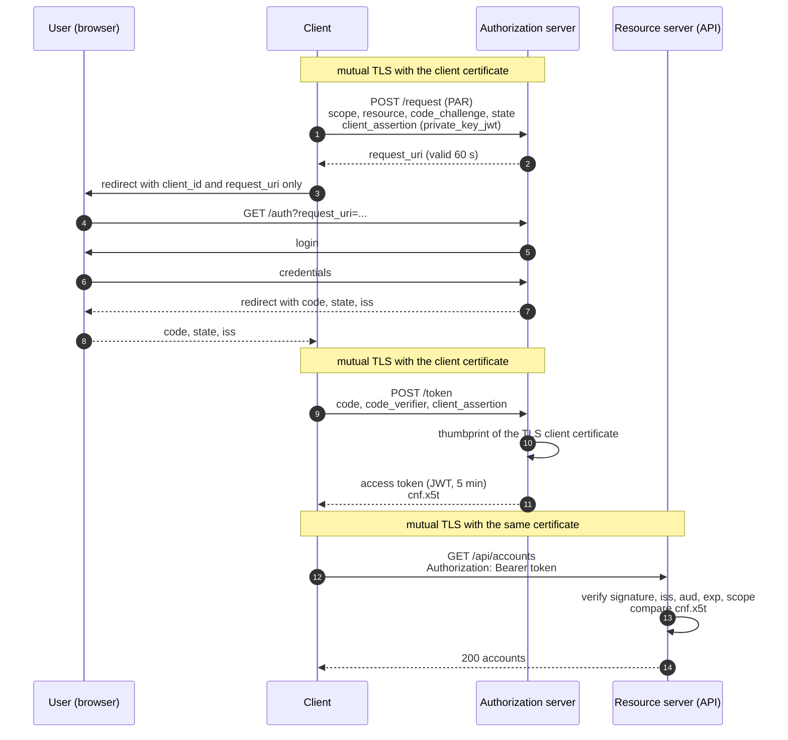

# oauth-mtls-reference

[](https://github.com/BaSTeD/oauth-mtls-reference/actions/workflows/ci.yml)
[](https://github.com/BaSTeD/oauth-mtls-reference/actions/workflows/codeql.yml)
[](LICENSE)

A runnable reference for the OAuth 2.0 setup used in open banking: pushed
authorization requests, PKCE, `private_key_jwt` and access tokens that are bound
to the client's TLS certificate (RFC 8705).

One command starts an authorization server, a protected API and a client. The
client gets a token, calls the API, and then shows that the same token is
worthless in the hands of anyone who does not hold the client's private key.

```
3. Token issued over mutual TLS              expires in 300s
   bound to certificate (cnf.x5t#S256)       owwGE0NPBsT6oH3IHtEsjE6-5Eik08_SjYJn5TiNisA

4. with the client certificate               200 OK, 2 accounts returned
5. with another valid certificate            401 access token is not bound to the presented client certificate
6. without a certificate                     401 a trusted client certificate is required
```

## Quick start

Requires Docker with Compose v2.

```bash
git clone https://github.com/BaSTeD/oauth-mtls-reference.git
cd oauth-mtls-reference
cp .env.example .env
docker compose up -d --wait
docker compose run --rm demo-client
```

The first start builds the image and generates a throwaway test PKI into a
Docker volume. `docker compose down -v` removes everything again.

## The flow



| Step | Mechanism | Specification |
|---|---|---|
| 1 to 2 | Pushed authorization request | [RFC 9126](https://www.rfc-editor.org/rfc/rfc9126) |
| 1, 9 | Client authentication with a signed assertion | [RFC 7523](https://www.rfc-editor.org/rfc/rfc7523) |
| 1, 9 | Proof key for code exchange, S256 | [RFC 7636](https://www.rfc-editor.org/rfc/rfc7636) |
| 1 | Audience-restricted token for one API | [RFC 8707](https://www.rfc-editor.org/rfc/rfc8707) |
| 7 | Issuer identification in the response | [RFC 9207](https://www.rfc-editor.org/rfc/rfc9207) |
| 10 to 13 | Certificate-bound access token | [RFC 8705](https://www.rfc-editor.org/rfc/rfc8705) |
| 11, 13 | JWT access token profile | [RFC 9068](https://www.rfc-editor.org/rfc/rfc9068) |

## The certificate binding check

This is the part the rest of the repository exists to demonstrate. The
authorization server writes the SHA-256 thumbprint of the client certificate
into the token. The API recomputes it from the certificate on the current TLS
connection and compares
([binding.ts](packages/resource-server/src/binding.ts)):

```ts
export function certificateThumbprint(cert: X509Certificate): string {
  return createHash('sha256').update(cert.raw).digest('base64url');
}

export function isBoundToCertificate(claims: Record<string, unknown>, cert: X509Certificate): boolean {
  const cnf = claims.cnf;
  if (typeof cnf !== 'object' || cnf === null) return false;

  const expected = (cnf as Record<string, unknown>)['x5t#S256'];
  if (typeof expected !== 'string' || expected.length === 0) return false;

  const a = Buffer.from(expected);
  const b = Buffer.from(certificateThumbprint(cert));
  return a.length === b.length && timingSafeEqual(a, b);
}
```

A token without a `cnf` claim is rejected as well. The API does not accept plain
bearer tokens at all.

## What is in the box

| Path | Purpose |
|---|---|
| [packages/auth-server](packages/auth-server/src) | [`oidc-provider`](https://github.com/panva/node-oidc-provider), configured. No protocol code of its own, only [configuration](packages/auth-server/src/config.ts) and a minimal login. |
| [packages/resource-server](packages/resource-server/src) | The API. Validates the JWT with [`jose`](https://github.com/panva/jose) and enforces the certificate binding. |
| [packages/demo-client](packages/demo-client/src) | Runs the flow with [`openid-client`](https://github.com/panva/openid-client) and plays the user's browser, so the demo needs no manual steps. |
| [scripts/gen-certs.sh](scripts/gen-certs.sh) | Test PKI: root CA, intermediate CA, server and client certificates, signing keys. |
| [scripts/rotate-client.sh](scripts/rotate-client.sh) | Issues a new client certificate. |
| [test](test) | Unit tests for the binding check, integration tests for the full flow. |

## Certificate rotation

```bash
docker compose run --rm certs ./scripts/rotate-client.sh /certs
docker compose run --rm demo-client
```

The authorization server trusts the CA, not an individual certificate, so the
client can rotate without any change on the server side. Tokens issued before
the rotation stay bound to the old certificate and stop working with the new
one. The client simply requests a new token.

## Threat model

What an attacker might try, what stops it, and the test that proves it. All
tests are in [test/flow.test.ts](test/flow.test.ts).

| Attack | Mitigation | Test |
|---|---|---|
| Steal an access token (logs, proxy, compromised API) and replay it | Token is bound to the client certificate. Without the private key it is rejected. | `rejects a stolen token presented with a different valid certificate`, `rejects the token without any client certificate` |
| Present the token with a self-made certificate carrying the client's name | Certificate must chain to the trusted CA, and the binding uses the thumbprint, not the subject | `rejects a certificate that does not chain to the trusted CA` |
| Intercept the authorization code on its way through the browser | PKCE: the code is useless without the verifier, which never leaves the client | `refuses the code when the PKCE verifier does not match` |
| Tamper with scope or redirect URI in the browser | PAR: parameters are sent over an authenticated back channel. The browser only sees an opaque `request_uri`. | `refuses authorization requests that bypass PAR` |
| Impersonate the client | `private_key_jwt`: no shared secret exists that could leak. A valid assertion needs the client's private key. | `refuses a pushed request from a client that cannot prove its identity` |
| Obtain an unbound token by skipping mutual TLS at the token endpoint | The server refuses to issue a token to this client without a certificate | `refuses to issue a token when the client presents no certificate` |
| Forge or modify a token | ES256 signature, algorithm allow-list, `alg: none` rejected | `rejects a token whose payload was modified`, `rejects an unsigned token (alg none)` |
| Use a token meant for another API, or from another issuer | `aud` and `iss` are checked | `rejects a token issued for another audience`, `rejects a token from another issuer` |
| Downgrade to a bearer token | Tokens without `cnf` are rejected | `rejects a plain bearer token without certificate binding` |
| Use a leaked token later | Five minute lifetime | `rejects an expired token` |
| Keep using a compromised client certificate | Rotate it. Old tokens die with the old certificate. | `invalidates tokens bound to the previous certificate` |

## FAPI 2.0 Security Profile mapping

How this setup lines up with the
[FAPI 2.0 Security Profile](https://openid.net/specs/fapi-security-profile-2_0-final.html).
This is a mapping for orientation, not a certification. The setup has not been
run against the OpenID conformance suite.

**Tested** means a test in this repository fails if the property breaks.
**Configured** means it is set in [config.ts](packages/auth-server/src/config.ts)
and enforced by `oidc-provider`, which runs here with its FAPI 2.0 profile enabled.

| Requirement | Status |
|---|---|
| Authorization code flow only | Tested (metadata) |
| Confidential clients only, authenticated with `private_key_jwt` or mTLS | Tested |
| Pushed authorization requests required, client authenticated at the PAR endpoint | Tested |
| PKCE with S256 required | Tested |
| Sender-constrained access tokens through mTLS or DPoP | Tested (mTLS) |
| `iss` parameter in the authorization response | Tested (metadata), verified by the client |
| Signing algorithms limited to PS256, ES256 or EdDSA | Tested (ES256 and PS256 allowed, ES256 in use) |
| Authorization code lifetime of at most 60 seconds | Configured |
| `request_uri` lifetime below 600 seconds | Configured (60 seconds) |
| Authorization codes cannot be reused | Configured |
| TLS 1.2 or later with secure cipher suites | Configured (TLS 1.3 only) |
| Resource server verifies integrity, expiry, audience, scope and sender constraint | Tested |
| Access token only accepted in the `Authorization` header | Tested implicitly, no other transport is implemented |
| Resource server checks whether a token has been revoked | **Not covered.** Tokens are self-contained JWTs. The exposure is limited by the five minute lifetime. |
| DNSSEC, end-user authentication strength, key management | **Out of scope** for a local reference |

## Security considerations

- **TLS is terminated in Node on purpose.** It keeps the certificate check
  visible in the code. In production, TLS usually ends at a gateway or load
  balancer that forwards the client certificate in a header. Then the
  application must only trust that header on connections from the gateway, and
  the gateway must strip it from incoming requests. Otherwise anyone can claim
  any certificate.
- **Client certificates are optional at the TLS layer** (`requestCert: true`,
  `rejectUnauthorized: false`), because browsers reach the authorization
  endpoint without one, and because a JSON 401 is easier to work with than a
  failed handshake. Every protected path therefore checks `socket.authorized`
  explicitly. Removing that check would accept self-signed certificates.
- **The binding is on the certificate, not the key.** Renewing a certificate
  for the same key still invalidates outstanding tokens. With five minute
  tokens that costs one extra token request.
- **Two separate client keys.** The TLS key binds tokens, the `private_key_jwt`
  key authenticates the client. Leaking one does not compromise the other.
- **Error responses stay generic.** The API reports `invalid_token` without
  saying which JWT check failed.
- **Nothing secret is committed.** Certificates and keys are generated locally
  and git-ignored. CI runs gitleaks on every push.

## Non-goals

This is a reference to read and run, not something to deploy.

- No persistence. `oidc-provider` uses its in-memory adapter, so sessions and
  grants are lost on restart.
- No real user management. There is exactly one demo account, configured
  through environment variables.
- No consent screen. The demo client is treated as first-party.
- No refresh tokens, no dynamic client registration, no logout flows.
- The test CA has no revocation and no hardware-protected keys.

## Development

Requires Node.js 22 or later and OpenSSL.

```bash
npm ci
npm test            # generates its own certificates in a temp directory
npm run lint
npm run typecheck
```

The integration tests start both servers in-process on random ports and run the
real flow against them, including the rotation script.

CI runs lint, typecheck, the tests, the complete Docker Compose flow, gitleaks
and CodeQL. Dependabot keeps npm packages, the base image and the workflow
actions current.

## Roadmap

- Certificate revocation: reject a revoked client certificate (CRL from the test CA)
- DPoP ([RFC 9449](https://www.rfc-editor.org/rfc/rfc9449)) as an alternative to mTLS
- Structured audit log for every rejected request
- A run against the OpenID FAPI 2.0 conformance suite

## License

[MIT](LICENSE)
